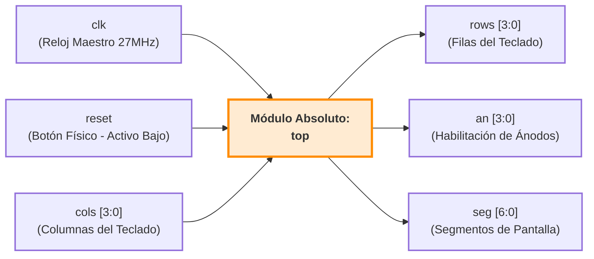

# Informe de Diseño: Sistema de División Entera Secuencial

## Estudiantes:
- Daniel Montero Vargas
- José Guerrero

## Introducción
Este proyecto consiste en el diseño e implementación de un sistema digital sincrónico en SystemVerilog para una FPGA Tang Nano 9K. El sistema funciona como una calculadora de división entera secuencial operada mediante un teclado matricial hexadecimal, cuyo procesamiento aritmético se ejecuta de forma iterativa y cuyos resultados intermedios y finales son administrados dinámicamente para ser proyectados en un bloque de displays de 7 segmentos mediante multiplexación temporal.

---

## Abreviaturas
- **FPGA**: Field Programmable Gate Arrays
- **rst**: Reset (Reinicio Asíncrono)
- **clk**: Clock (Reloj de Sistema)
- **BCD**: Binary-Coded Decimal (Decimal Codificado en Binario)
- **HDL**: Hardware Description Language (Lenguaje de Descripción de Hardware)
- **FSMD**: Finite State Machine with Datapath (Máquina de Estados con Ruta de Datos)
- **MSB**: Most Significant Bit (Bit Más Significativo)

---

## 1. Descripción General del Funcionamiento del Circuito Completo

El circuito integrado completo funciona como una calculadora de división entera secuencial operada por teclado. La arquitectura está gobernada por el módulo de jerarquía superior (`div_top`), el cual interconecta los bloques de captura, procesamiento aritmético, conversión de formato y multiplexación de visualización.

El flujo de control y datos del circuito sigue el siguiente orden cronológico:

1. **Captura y Composición:** El circuito inicia en un estado de espera. El usuario digita el dividendo mediante el teclado (`key_in`). El sistema detecta los flancos de la señal `valid` para evitar lecturas múltiples y procesa secuencialmente las decenas y unidades. Al presionar la tecla `A`, el dividendo se almacena firmemente de forma interna. Posteriormente, el usuario digita el divisor (limitado por hardware a un máximo de 15 por seguridad arquitectónica) y presiona la tecla `B`.
2. **Cómputo Secuencial:** Al confirmarse el divisor con la tecla `B`, el subsistema de entrada genera un pulso de inicio (`start_calc`). Esto despierta a la unidad aritmética (`divisor`), la cual ejecuta el algoritmo de división por restauraciones sucesivas (*Shift-and-Subtract*) a lo largo de varios ciclos de reloj.
3. **Conversión y Decodificación:** Una vez terminado el cálculo, el divisor activa la señal `done`. El circuito toma inmediatamente el cociente, el residuo y el divisor en binario puro y, mediante bloques lógicos combinacionales, los traduce al formato BCD (separando decenas de unidades).
4. **Navegación de Resultados:** Tras el pulso `done`, la interfaz de pantalla cambia. Deja de mostrar el registro temporal de escritura y bloquea la pantalla en modo "Resultados". A partir de este momento, el usuario puede presionar las teclas de control para inspeccionar los datos finales en los displays: `A` muestra el dividendo, `B` el divisor, `C` el cociente y `D` el residuo.

---

## 2. Descripciones Técnicas y Código de los Módulos

A continuación se detallan las especificaciones de diseño, funcionamiento de control y el código fuente en SystemVerilog de cada uno de los bloques estructurales que conforman el sistema.

### 2.1 Módulo clk_divider
* **Descripción:** Divisor de frecuencia por conteo binario. Reduce la señal del reloj maestro de la FPGA (27 MHz) para generar una señal de habilitación periódica (`tick`) de baja frecuencia necesaria para la multiplexación temporal de los displays de 7 segmentos sin sobrecargar la conmutación de los transistores.
```systemverilog
module clk_divider (
    input  logic clk,    
    input  logic rst,    
    output logic tick    
);
    logic [13:0] count;

    always_ff @(posedge clk or posedge rst) begin
        if (rst) 
            count <= 14'd0;         
        else     
            count <= count + 1'b1;  
    end

    assign tick = (count == 14'd0);
endmodule
```

### 2.2 Módulo anode_control
* **Descripción:**Controlador secuencial de ánodos/cátodos para la multiplexación de displays. Conmutador cíclico basado en un contador de dos bits que activa secuencialmente uno de los cuatro dígitos físicos disponibles de manera síncrona con el pulso generado por el divisor de reloj.
```systemverilog
module anode_control (
    input  logic clk,       
    input  logic rst,       
    input  logic tick,      
    output logic [1:0] sel, 
    output logic [3:0] anode 
);
    always_ff @(posedge clk or posedge rst) begin
        if (rst) begin
            sel   <= 2'd0;
            anode <= 4'b0000;
        end else if (tick) begin
            sel <= sel + 1'b1;
            
            case (sel)
                2'd0: anode <= 4'b0001; // Activa Dígito 0 (Derecha)
                2'd1: anode <= 4'b0010; // Activa Dígito 1
                2'd2: anode <= 4'b0100; // Activa Dígito 2
                2'd3: anode <= 4'b1000; // Activa Dígito 3 (Izquierda)
            endcase
        end
    end
endmodule
```


### 2.3 Módulo hex_to_7seg
* **Descripción:**Decodificador combinacional puro. Transforma una palabra de 4 bits en código hexadecimal a su representation equivalente en un display de 7 segmentos empleando lógica directa para configuraciones de cátodo común (un '1' lógico enciende el segmento).
```systemverilog
module hex_to_7seg (
    input  logic [3:0] hex, 
    output logic [6:0] seg  
);
    always_comb begin
        unique case (hex)
            4'h0: seg = 7'b0111111; // Muestra '0'
            4'h1: seg = 7'b0000110; // Muestra '1'
            4'h2: seg = 7'b1011011; // Muestra '2'
            4'h3: seg = 7'b1001111; // Muestra '3'
            4'h4: seg = 7'b1100110; // Muestra '4'
            4'h5: seg = 7'b1101101; // Muestra '5'
            4'h6: seg = 7'b1111101; // Muestra '6'
            4'h7: seg = 7'b0000111; // Muestra '7'
            4'h8: seg = 7'b1111111; // Muestra '8'
            4'h9: seg = 7'b1101111; // Muestra '9'
            4'hA: seg = 7'b1110111; // Muestra 'A'
            4'hB: seg = 7'b1111100; // Muestra 'b'
            4'hC: seg = 7'b0111001; // Muestra 'C'
            4'hD: seg = 7'b1011110; // Muestra 'd'
            4'hE: seg = 7'b1111001; // Muestra 'E'
            4'hF: seg = 7'b1110001; // Muestra 'F'
            default: seg = 7'b0000000;
        endcase
    end
endmodule
```


### 2.4 Módulo display
* **Descripción:**Envoltorio estructural de visualización completa. Integra el divisor de frecuencia, el asignador secuencial de posiciones y el convertidor combinacional a 7 segmentos para multiplexar dinámicamente un bus de entrada de 16 bits en un arreglo físico de pantallas.
```systemverilog
module display (
    input  logic clk,           
    input  logic rst,           
    input  logic [15:0] num_in, 
    output logic [3:0]  enc_an, 
    output logic [6:0]  enc_seg 
);
    logic scan_tick;         
    logic [1:0] sel;         
    logic [3:0] current_val; 

    clk_divider timer (
        .clk(clk),
        .rst(rst),
        .tick(scan_tick)
    );

    anode_control controller (
        .clk(clk),
        .rst(rst),
        .tick(scan_tick),
        .sel(sel),
        .anode(enc_an)
    );

    always_comb begin
        case (sel)
            2'd0: current_val = num_in[3:0];   
            2'd1: current_val = num_in[7:4];   
            2'd2: current_val = num_in[11:8];  
            2'd3: current_val = num_in[15:12]; 
            default: current_val = 4'h0;
        endcase
    end

    hex_to_7seg decoder (
        .hex(current_val),
        .seg(enc_seg)
    );
endmodule
```


### 2.5 Módulo key_scanner
* **Descripción:**Escaneador matricial secuencial. Modifica cíclicamente el estado de excitación de las filas del teclado físico mediante un registro de desplazamiento de un solo bit activo alto, deteniendo su barrido de forma inteligente cuando se registra una pulsación de tecla activa.
```systemverilog
module key_scanner #(
    parameter SCAN_DIV = 15000 
)(
    input  logic        clk,         
    input  logic        rst,         
    input  logic        scan_enable, 
    output logic [1:0] scanned_row, 
    output logic [3:0] row          
);
    logic [15:0] scan_cnt; 
    logic scan_tick;

    assign scan_tick = (scan_cnt >= SCAN_DIV); 

    always_ff @(posedge clk or posedge rst) begin 
        if (rst)
            scan_cnt <= 0;
        else if (scan_tick)
            scan_cnt <= 0; 
        else
            scan_cnt <= scan_cnt + 1'b1;
    end

    always_ff @(posedge clk or posedge rst) begin
        if (rst) begin
            scanned_row <= 2'd0;
        end else if (scan_tick && scan_enable) begin
            scanned_row <= scanned_row + 1'b1;
        end
    end

    always_comb begin
        case (scanned_row)
            2'd0: row = 4'b0001; 
            2'd1: row = 4'b0010; 
            2'd2: row = 4'b0100; 
            2'd3: row = 4'b1000; 
            default: row = 4'b0000;
        endcase
    end
endmodule
```


### 2.6 Módulo key_decoder
* **Descripción:**Decodificador combinacional de matriz a hexadecimal. Mapea la intersección binaria entre la fila de excitación activa actual y la columna de lectura devuelta por el periférico físico, convirtiéndola en una palabra de 4 bits representativa del valor de la tecla pulsada.
```systemverilog
module key_decoder (
    input  logic [1:0] scanned_row, 
    input  logic [3:0] col,         
    output logic [3:0] raw_key,     
    output logic       fila_pres    
);
    always_comb begin
        fila_pres = 1'b0;
        raw_key   = 4'h0;
        
        case (scanned_row)
            2'd0: if (col != 4'b0000) begin
                fila_pres = 1'b1;
                case (col)
                    4'b0001: raw_key = 4'h1; 
                    4'b0010: raw_key = 4'h2; 
                    4'b0100: raw_key = 4'h3; 
                    4'b1000: raw_key = 4'hA; 
                    default: fila_pres = 1'b0;
                endcase
            end

            2'd1: if (col != 4'b0000) begin
                fila_pres = 1'b1;
                case (col)
                    4'b0001: raw_key = 4'h4; 
                    4'b0010: raw_key = 4'h5; 
                    4'b0100: raw_key = 4'h6; 
                    4'b1000: raw_key = 4'hB; 
                    default: fila_pres = 1'b0;
                endcase
            end

            2'd2: if (col != 4'b0000) begin
                fila_pres = 1'b1;
                case (col)
                    4'b0001: raw_key = 4'h7; 
                    4'b0010: raw_key = 4'h8; 
                    4'b0100: raw_key = 4'h9; 
                    4'b1000: raw_key = 4'hC; 
                    default: fila_pres = 1'b0;
                endcase
            end

            2'd3: if (col != 4'b0000) begin
                fila_pres = 1'b1;
                case (col)
                    4'b0001: raw_key = 4'hE; 
                    4'b0010: raw_key = 4'h0; 
                    4'b0100: raw_key = 4'hF; 
                    4'b1000: raw_key = 4'hD; 
                    default: fila_pres = 1'b0;
                endcase
            end
            default: fila_pres = 1'b0;
        endcase
    end
endmodule
```


### 2.7 Módulo key_debouncer
* **Descripción:**Filtro síncrono antirebotes basado en máquina de estados (FSM). Implementa una ventana de histéresis temporal mediante contadores internos para limpiar las señales espurias transitorias del contacto mecánico del botón antes de disparar un pulso de validez único de un ciclo de reloj.
```systemverilog
module key_debouncer #(
    parameter DEBOUNCE_TIME = 270000 
)(
    input  logic        clk,       
    input  logic        rst,       
    input  logic        fila_pres, 
    input  logic [3:0]  raw_key,   
    output logic [3:0]  key_out,   
    output logic        valid,     
    output logic        is_idle    
);
    typedef enum logic [1:0] {IDLE = 2'd0, DEBOUNCE = 2'd1, PRESSED = 2'd2} state_t;
    state_t state;
    logic [31:0] debounce_cnt; 
    logic [3:0]  stable_key;   

    assign is_idle = (state == IDLE);

    always_ff @(posedge clk or posedge rst) begin
        if (rst) begin
            state        <= IDLE;
            debounce_cnt <= 0;
            valid        <= 0;
            key_out      <= 0;
            stable_key   <= 0;
        end else begin
            valid <= 1'b0; 
            
            case (state)
                IDLE: begin
                    if (fila_pres) begin
                        stable_key   <= raw_key; 
                        debounce_cnt <= 0;
                        state        <= DEBOUNCE;
                    end
                end

                DEBOUNCE: begin
                    if (fila_pres && raw_key == stable_key) begin
                        if (debounce_cnt >= DEBOUNCE_TIME) begin
                            key_out <= stable_key; 
                            valid   <= 1'b1;       
                            state   <= PRESSED;
                        end else begin
                            debounce_cnt <= debounce_cnt + 1'b1;
                        end
                    end else begin
                        state <= IDLE;
                    end
                end

                PRESSED: begin
                    if (!fila_pres) begin
                        debounce_cnt <= 0;
                        state        <= IDLE; 
                    end
                end
                default: state <= IDLE;
            endcase
        end
    end
endmodule
```


### 2.8 Módulo teclado_completo
* **Descripción:**Integrador estructural del subsistema de entrada. Acopla el barrido secuencial de líneas físicas, la traducción lógica de cruce y el filtrado por histéresis para proveer una interfaz limpia de adquisición de caracteres hexadecimales.
```systemverilog
module teclado_completo (
    input  logic clk,
    input  logic rst,
    output logic [3:0] row,
    input  logic [3:0] col,
    output logic [3:0] key_out,
    output logic valid
);
    logic [1:0] scanned_row; 
    logic [3:0] raw_key;     
    logic       fila_pres;   
    logic       is_idle;     

    key_scanner scanner_inst (
        .clk(clk),
        .rst(rst),
        .scan_enable(is_idle), 
        .scanned_row(scanned_row),
        .row(row)
    );

    key_decoder decoder_inst (
        .scanned_row(scanned_row),
        .col(col),
        .raw_key(raw_key),
        .fila_pres(fila_pres)
    );

    key_debouncer debouncer_inst (
        .clk(clk),
        .rst(rst),
        .fila_pres(fila_pres),
        .raw_key(raw_key),
        .key_out(key_out),
        .valid(valid),
        .is_idle(is_idle)
    );
endmodule
```


### 2.9 Módulo input_div
* **Descripción:**FSM de procesamiento y empaquetamiento de entrada. Administra las fases de captura interactiva de operandos decimales ingresados por teclas secuenciales, calcula el producto por ponderación (decenas * 10) y aplica la cota de protección restrictiva (máximo 15) en el bus del divisor.
```systemverilog
module input_div (
    input  logic        clk,
    input  logic        rst,
    input  logic [3:0]  key_in,       
    input  logic        valid,        
    output logic [5:0]  dividendo,    
    output logic [3:0]  divisor,      
    output logic        start_calc,   
    output logic [15:0] num_registro, 
    output logic [3:0]  decenas,      
    output logic [3:0]  unidades      
);
    typedef enum logic [1:0] {ESPERA_DIVIDENDO, ESPERA_DIVISOR} state_t;
    state_t state;
    
    logic       tengo_decenas_num;
    logic       tengo_decenas_div; 
    logic [3:0] dec_div;           
    logic       valid_prev;
    logic       valid_pulse;
    
    always_ff @(posedge clk or posedge rst) begin
        if (rst) valid_prev <= 0;
        else valid_prev <= valid;
    end
    assign valid_pulse = valid & ~valid_prev; 
    
    always_ff @(posedge clk or posedge rst) begin
        if (rst) begin
            state             <= ESPERA_DIVIDENDO;
            dividendo         <= 0;
            divisor           <= 0;
            decenas           <= 0;
            unidades          <= 0;
            tengo_decenas_num <= 0;
            tengo_decenas_div <= 0;
            dec_div           <= 0;
            start_calc        <= 0;
            num_registro      <= 16'h0000;
        end else begin
            start_calc <= 0; 
            
            case (state)
                ESPERA_DIVIDENDO: begin
                    if (valid_pulse && key_in <= 4'h9) begin
                        if (!tengo_decenas_num) begin
                            decenas           <= key_in;
                            unidades          <= 4'h0; 
                            tengo_decenas_num <= 1;
                            dividendo         <= {2'b00, key_in};
                            num_registro      <= {12'b0, key_in}; 
                        end else begin
                            unidades          <= key_in;
                            tengo_decenas_num <= 0;
                            dividendo         <= (decenas * 10) + key_in;
                            num_registro      <= {8'b0, decenas, key_in}; 
                        end
                    end
                    
                    if (valid_pulse && key_in == 4'hA) begin 
                        if (tengo_decenas_num) begin
                            dividendo         <= {2'b00, decenas};
                            num_registro      <= {12'b0, decenas};
                            tengo_decenas_num <= 0;
                        end
                        state <= ESPERA_DIVISOR;
                        tengo_decenas_div <= 0;
                    end
                end
                
                ESPERA_DIVISOR: begin
                    if (valid_pulse && key_in <= 4'h9) begin
                        if (!tengo_decenas_div) begin
                            dec_div           <= key_in;
                            tengo_decenas_div <= 1;
                            divisor           <= key_in; 
                            num_registro      <= {12'b0, key_in}; 
                        end else begin
                            tengo_decenas_div <= 0;
                            if (((dec_div * 10) + key_in) > 15) begin
                                divisor      <= 4'd15; 
                                num_registro <= {8'b0, 4'h1, 4'h5};
                            end else begin
                                divisor      <= ((dec_div * 10) + key_in);
                                num_registro <= {8'b0, dec_div, key_in};
                            end
                        end
                    end
                    
                    if (valid_pulse && key_in == 4'hB) begin 
                        if (tengo_decenas_div) begin
                            divisor           <= dec_div;
                            tengo_decenas_div <= 0;
                        end
                        num_registro <= 16'h0000;
                        start_calc   <= 1;
                        state        <= ESPERA_DIVIDENDO;
                    end
                end
            endcase
        end
    end
endmodule
```

### 2.10 Módulo divisor
* **Descripción:**Coprocesador aritmético basado en FSMD. Implementa el algoritmo iterativo de división por resta y desplazamiento izquierdo binario (Shift-and-Subtract). Evalúa el bit de signo del residuo intermedio parcial para decidir la restauración del acumulador y consolidar el bit correspondiente del cociente final en un lazo sincronizado de alta frecuencia.
```systemverilog
module divisor (
    input  logic        clk,
    input  logic        rst,
    input  logic        start,        
    input  logic [5:0]  dividendo,    
    input  logic [3:0]  divisor,      
    output logic [5:0]  cociente,     
    output logic [3:0]  residuo,      
    output logic        done          
);
    typedef enum logic [2:0] {IDLE, INICIO, RESTA, DECIDE, SIGUIENTE, FIN} state_t;
    state_t state;

    logic [5:0] R;             
    logic [5:0] resta;         
    logic [2:0] bit_index;     
    logic [5:0] temp_cociente; 
    logic [5:0] cociente_out;
    logic [3:0] residuo_out;

    always_ff @(posedge clk or posedge rst) begin
        if (rst) begin
            state         <= IDLE;
            temp_cociente <= 0;
            R             <= 0;
            bit_index     <= 0;
            cociente_out  <= 0;
            residuo_out   <= 0;
            done          <= 0;
        end else begin
            done <= 0; 

            case (state)
                IDLE: begin
                    if (start) begin
                        temp_cociente <= 0;
                        R             <= 0;
                        bit_index     <= 3'd5; 
                        state         <= INICIO;
                    end
                end

                INICIO: begin
                    R     <= {R[4:0], dividendo[bit_index]}; 
                    state <= RESTA;
                end

                RESTA: begin
                    resta <= R - {2'b00, divisor}; 
                    state <= DECIDE;
                end

                DECIDE: begin
                    if (resta[5]) begin 
                        temp_cociente[bit_index] <= 1'b0;
                    end else begin      
                        temp_cociente[bit_index] <= 1'b1;
                        R <= resta;     
                    end
                    state <= SIGUIENTE;
                end

                SIGUIENTE: begin
                    if (bit_index == 0)
                        state <= FIN;
                    else begin
                        bit_index <= bit_index - 1;
                        state     <= INICIO;
                    end
                end

                FIN: begin
                    cociente_out <= temp_cociente;
                    residuo_out  <= R[3:0];
                    done         <= 1;
                    state        <= IDLE;
                end
                default: state <= IDLE;
            endcase
        end
    end

    always_ff @(posedge clk or posedge rst) begin
        if (rst) begin
            cociente <= 0;
            residuo  <= 0;
        end else if (done) begin
            cociente <= cociente_out;
            residuo  <= residuo_out;
        end
    end
endmodule
```
### 2.11 Módulo selector_div
* **Descripción:**Enrutador dinámico de datos y multiplexor de vistas de salida. Funciona como una máquina de estados secundaria que vigila las directivas del teclado del usuario posterior al pulso done. Conmuta el bus de datos hacia los displays de 7 segmentos entre dividendo, divisor, cociente o residuo según la tecla de comando presionada de forma persistente.
```systemverilog
module selector_div (
    input  logic        clk,
    input  logic        rst,
    input  logic        valid,         
    input  logic [3:0]  key_in,        
    input  logic        done,          
    input  logic [3:0]  decenas,       
    input  logic [3:0]  unidades,
    input  logic [7:0]  divisor_bcd,   
    input  logic [7:0]  cociente_bcd,
    input  logic [7:0]  residuo_bcd,
    input  logic [15:0] num_registro,  
    output logic [15:0] num_out        
);
    typedef enum logic [1:0] {VER_COCIENTE, VER_RESIDUO, VER_DIVIDENDO, VER_DIVISOR} modo_vista_t;
    modo_vista_t modo_vista;
    logic resultado_activo;   
    logic [3:0] key_guardada; 

    always_ff @(posedge clk or posedge rst) begin
        if (rst)
            key_guardada <= 4'h0;
        else if (valid)
            key_guardada <= key_in; 
    end

    always_ff @(posedge clk or posedge rst) begin
        if (rst) begin
            modo_vista       <= VER_COCIENTE;
            resultado_activo <= 1'b0;
        end else begin
            if (done) begin
                resultado_activo <= 1'b1;        
                modo_vista       <= VER_COCIENTE; 
            end

            if (resultado_activo) begin
                case (key_guardada)
                    4'hA: modo_vista <= VER_DIVIDENDO; 
                    4'hB: modo_vista <= VER_DIVISOR;   
                    4'hC: modo_vista <= VER_COCIENTE;  
                    4'hD: modo_vista <= VER_RESIDUO;   
                    default: modo_vista <= modo_vista; 
                endcase
            end
        end
    end

    always_comb begin
        if (resultado_activo) begin
            case (modo_vista)
                VER_DIVIDENDO: num_out = {8'b0, decenas, unidades};
                VER_DIVISOR:   num_out = {8'b0, divisor_bcd};
                VER_COCIENTE:  num_out = {8'b0, cociente_bcd};
                VER_RESIDUO:   num_out = {8'b0, residuo_bcd};
                default:       num_out = {8'b0, cociente_bcd};
            endcase
        end else begin
            num_out = num_registro;
        end
    end
endmodule
```

### 2.12 Módulo div_top
* **Descripción:**Unidad estructural raíz e interconexión global. Instancia los submódulos funcionales del sistema e implementa bloques combinacionales paralelos optimizados always_comb para convertir directamente los resultados aritméticos binarios crudos a formato BCD segmentado antes de transferirlos a las pantallas.
```systemverilog
module div_top (
    input  logic        clk,
    input  logic        rst,
    input  logic [3:0]  key_in,
    input  logic        valid,
    output logic [15:0] num_out
);
    logic [5:0] dividendo;
    logic [3:0] divisor;
    logic       start_calc;
    logic [5:0] cociente;
    logic [3:0] residuo;
    logic       done;

    logic [7:0] cociente_bcd;
    logic [7:0] residuo_bcd;
    logic [7:0] divisor_bcd;

    logic [15:0] num_reg_intermitente;
    logic [3:0] wire_decenas;
    logic [3:0] wire_unidades;

    input_div u_input_div (
        .clk(clk),
        .rst(rst),
        .key_in(key_in),
        .valid(valid),
        .dividendo(dividendo),
        .divisor(divisor),
        .start_calc(start_calc),
        .num_registro(num_reg_intermitente),
        .decenas(wire_decenas),
        .unidades(wire_unidades)
    );

    divisor u_divisor (
        .clk(clk),
        .rst(rst),
        .start(start_calc),
        .dividendo(dividendo),
        .divisor(divisor),
        .cociente(cociente),
        .residuo(residuo),
        .done(done)
    );

    always_comb begin
        if (cociente >= 6'd50)   cociente_bcd = {4'd5, cociente - 6'd50};
        else if (cociente >= 6'd40) cociente_bcd = {4'd4, cociente - 6'd40};
        else if (cociente >= 6'd30) cociente_bcd = {4'd3, cociente - 6'd30};
        else if (cociente >= 6'd20) cociente_bcd = {4'd2, cociente - 6'd20};
        else if (cociente >= 6'd10) cociente_bcd = {4'd1, cociente - 6'd10}; 
        else                        cociente_bcd = {4'd0, cociente[3:0]};

        if (residuo >= 4'd10)       residuo_bcd = {4'd1, residuo - 4'd10};
        else                        residuo_bcd = {4'd0, residuo};

        if (divisor >= 4'd10)       divisor_bcd = {4'd1, divisor - 4'd10};
        else                        divisor_bcd = {4'd0, divisor};
    end

    selector_div u_selector_div (
        .clk(clk),
        .rst(rst),
        .valid(valid),
        .key_in(key_in),
        .done(done),
        .decenas(wire_decenas),
        .unidades(wire_unidades),
        .divisor_bcd(divisor_bcd),
        .cociente_bcd(cociente_bcd),
        .residuo_bcd(residuo_bcd),
        .num_registro(num_reg_intermitente),
        .num_out(num_out) 
    );
endmodule
```
### 2.13 Módulo top
* **Descripción:** Unidad raíz fundamental de todo el sistema integrado. Se encarga de la interconexión directa con los pines físicos de la FPGA Tang Nano 9K. Este módulo realiza tres tareas críticas: invierte la señal del botón físico de reinicio (`assign rst = ~reset`) para adecuarla a la lógica activa en alto del circuito, instancia el bloque de captura periférica (`teclado_completo`), inyecta los flujos de datos filtrados hacia el núcleo de procesamiento matemático secuencial (`div_top`), y finalmente enruta el bus de salida resultante de 16 bits hacia el controlador multiplexado de visualización física (`display`) para manejar dinámicamente los ánodos y segmentos.

```systemverilog
module top (
    input  logic       clk,
    input  logic       reset,
    output logic [3:0] rows,
    input  logic [3:0] cols,
    output logic [3:0] an,
    output logic [6:0] seg
);

    logic rst;
    logic [3:0] key_value;
    logic key_valid;
    logic [15:0] num_value;
    
    assign rst = ~reset;
    
    teclado_completo teclado_inst (
        .clk(clk),
        .rst(rst),
        .row(rows),
        .col(cols),
        .key_out(key_value),
        .valid(key_valid)
    );
    
    div_top division_inst (
        .clk(clk),
        .rst(rst),
        .key_in(key_value),
        .valid(key_valid),
        .num_out(num_value)
    );
    
    display display_inst (
        .clk(clk),
        .rst(rst),
        .num_in(num_value),
        .enc_an(an),
        .enc_seg(seg)
    );

endmodule
```
## 3. Diagramas de Bloques del Sistema

### 3.1 Diagrama de Bloques Externo (Entradas y Salidas de la FPGA hacia `top`)
Este diagrama representa la interfaz física con el entorno exterior, mostrando estrictamente los periféricos conectados a la Tang Nano 9K y los buses del módulo raíz absoluto.



### 3.2 Diagrama de Bloques Interno (Ruteo General del Sistema Integrado)
```mermaid
graph TD
    %% Configuración de Estilos
    classDef external fill:#ececff,stroke:#9370db,stroke-width:2px;
    classDef mainModule fill:#fffacd,stroke:#daa520,stroke-width:2px;
    classDef logicGate fill:#f0fff0,stroke:#2e8b57,stroke-width:1px;

    %% Entradas Físicas Externas (Fuera de top)
    EXT_CLK["clk (Reloj Maestro)"]:::external
    EXT_RESET["reset (Reset Activo Bajo)"]:::external
    EXT_COLS["cols [3:0] (Columnas)"]:::external

    %% Caja Contenedora del Módulo Top
    subgraph top ["Estructura General del Módulo top"]
        %% Compuesta por inversores e instancias
        INV_RST["Lógica Inversora<br>rst = ~reset"]:::logicGate
        
        MOD_TECLADO["Submódulo:<br>teclado_completo"]:::mainModule
        MOD_DIVISION["Submódulo:<br>div_top"]:::mainModule
        MOD_DISPLAY["Submódulo:<br>display"]:::mainModule

        %% Conexiones del Reset Interno Activo en Alto (rst)
        EXT_RESET --> INV_RST
        INV_RST --> |"rst"| MOD_TECLADO
        INV_RST --> |"rst"| MOD_DIVISION
        INV_RST --> |"rst"| MOD_DISPLAY

        %% Conexiones del Reloj Maestro
        EXT_CLK ---> MOD_TECLADO
        EXT_CLK ---> MOD_DIVISION
        EXT_CLK ---> MOD_DISPLAY

        %% Ruteo entre submódulos internos
        EXT_COLS --> MOD_TECLADO
        
        MOD_TECLADO --> |"key_out -> key_value [3:0]"| MOD_DIVISION
        MOD_TECLADO --> |"valid -> key_valid"| MOD_DIVISION
        
        MOD_DIVISION --> |"num_out -> num_value [15:0]"| MOD_DISPLAY
    end

    %% Salidas Físicas Externas (Fuera de top)
    EXT_ROWS["rows [3:0] (Filas)"]:::external
    EXT_AN["an [3:0] (Ánodos)"]:::external
    EXT_SEG["seg [6:0] (Segmentos)"]:::external

    %% Conexiones desde el interior hacia pines externos
    MOD_TECLADO --> EXT_ROWS
    MOD_DISPLAY --> EXT_AN
    MOD_DISPLAY --> EXT_SEG
    ```
