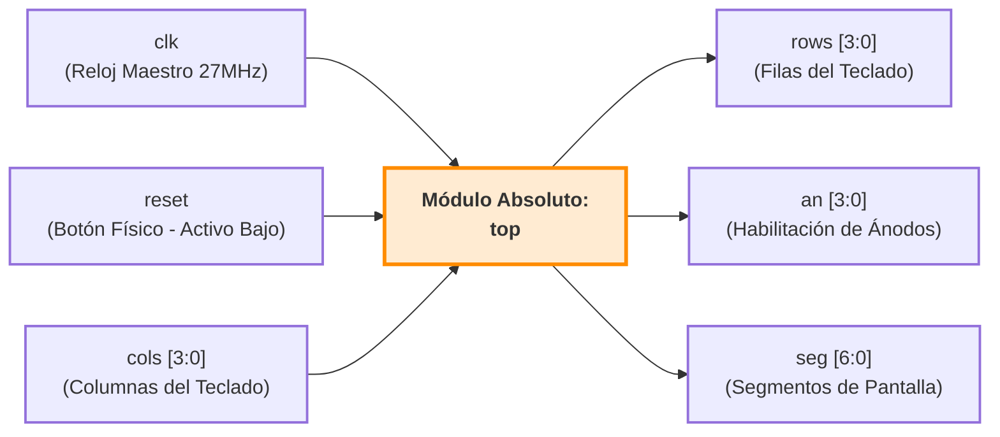
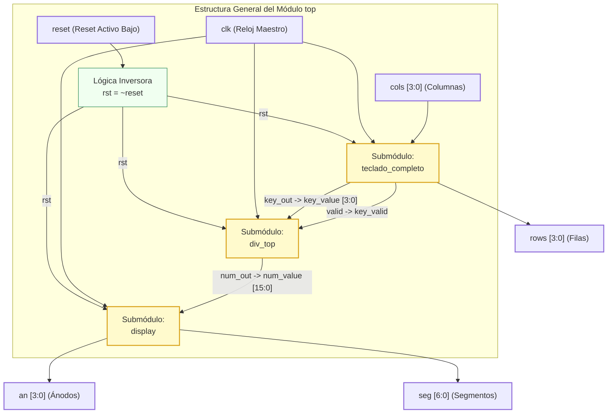

# Informe de Diseño: Sistema de División Entera Secuencial

## Estudiantes:
- Daniel Montero Vargas
- José Guerrero

## Introducción
Este proyecto consiste en el diseño e implementación de un sistema digital sincrónico en SystemVerilog para una FPGA Tang Nano 9K. El sistema funciona como una calculadora de división entera secuencial operada mediante un teclado matricial hexadecimal, cuyo procesamiento aritmético se ejecuta de forma iterativa y cuyos resultados intermedios y finales son administrados dinámicamente para ser proyectados en un bloque de displays de 7 segmentos mediante multiplexación temporal.

---

## Abreviaturas
- **FPGA**: Field Programmable Gate Arrays
- **rst**: Reset (Reinicio Asíncrono)
- **clk**: Clock (Reloj de Sistema)
- **BCD**: Binary-Coded Decimal (Decimal Codificado en Binario)
- **HDL**: Hardware Description Language (Lenguaje de Descripción de Hardware)
- **FSMD**: Finite State Machine with Datapath (Máquina de Estados con Ruta de Datos)
- **MSB**: Most Significant Bit (Bit Más Significativo)

---

## 1. Descripción General del Funcionamiento del Circuito Completo

El circuito integrado completo funciona como una calculadora de división entera secuencial operada por teclado. La arquitectura está gobernada por el módulo de jerarquía superior (`div_top`), el cual interconecta los bloques de captura, procesamiento aritmético, conversión de formato y multiplexación de visualización.

El flujo de control y datos del circuito sigue el siguiente orden cronológico:

1. **Captura y Composición:** El circuito inicia en un estado de espera. El usuario digita el dividendo mediante el teclado (`key_in`). El sistema detecta los flancos de la señal `valid` para evitar lecturas múltiples y procesa secuencialmente las decenas y unidades. Al presionar la tecla `A`, el dividendo se almacena firmemente de forma interna. Posteriormente, el usuario digita el divisor (limitado por hardware a un máximo de 15 por seguridad arquitectónica) y presiona la tecla `B`.
2. **Cómputo Secuencial:** Al confirmarse el divisor con la tecla `B`, el subsistema de entrada genera un pulso de inicio (`start_calc`). Esto despierta a la unidad aritmética (`divisor`), la cual ejecuta el algoritmo de división por restauraciones sucesivas (*Shift-and-Subtract*) a lo largo de varios ciclos de reloj.
3. **Conversión y Decodificación:** Una vez terminado el cálculo, el divisor activa la señal `done`. El circuito toma inmediatamente el cociente, el residuo y el divisor en binario puro y, mediante bloques lógicos combinacionales, los traduce al formato BCD (separando decenas de unidades).
4. **Navegación de Resultados:** Tras el pulso `done`, la interfaz de pantalla cambia. Deja de mostrar el registro temporal de escritura y bloquea la pantalla en modo "Resultados". A partir de este momento, el usuario puede presionar las teclas de control para inspeccionar los datos finales en los displays: `A` muestra el dividendo, `B` el divisor, `C` el cociente y `D` el residuo.

---

## 2. Descripciones Técnicas y Código de los Módulos

A continuación se detallan las especificaciones de diseño, funcionamiento de control y el código fuente en SystemVerilog de cada uno de los bloques estructurales que conforman el sistema.

### 2.1 Módulo clk_divider
* **Descripción:** Divisor de frecuencia por conteo binario. Reduce la señal del reloj maestro de la FPGA (27 MHz) para generar una señal de habilitación periódica (`tick`) de baja frecuencia necesaria para la multiplexación temporal de los displays de 7 segmentos sin sobrecargar la conmutación de los transistores.
```systemverilog
module clk_divider (
    input  logic clk,    
    input  logic rst,    
    output logic tick    
);
    logic [13:0] count;

    always_ff @(posedge clk or posedge rst) begin
        if (rst) 
            count <= 14'd0;         
        else     
            count <= count + 1'b1;  
    end

    assign tick = (count == 14'd0);
endmodule
```

### 2.2 Módulo anode_control
* **Descripción:**Controlador secuencial de ánodos/cátodos para la multiplexación de displays. Conmutador cíclico basado en un contador de dos bits que activa secuencialmente uno de los cuatro dígitos físicos disponibles de manera síncrona con el pulso generado por el divisor de reloj.
```systemverilog
module anode_control (
    input  logic clk,       
    input  logic rst,       
    input  logic tick,      
    output logic [1:0] sel, 
    output logic [3:0] anode 
);
    always_ff @(posedge clk or posedge rst) begin
        if (rst) begin
            sel   <= 2'd0;
            anode <= 4'b0000;
        end else if (tick) begin
            sel <= sel + 1'b1;
            
            case (sel)
                2'd0: anode <= 4'b0001; // Activa Dígito 0 (Derecha)
                2'd1: anode <= 4'b0010; // Activa Dígito 1
                2'd2: anode <= 4'b0100; // Activa Dígito 2
                2'd3: anode <= 4'b1000; // Activa Dígito 3 (Izquierda)
            endcase
        end
    end
endmodule
```


### 2.3 Módulo hex_to_7seg
* **Descripción:**Decodificador combinacional puro. Transforma una palabra de 4 bits en código hexadecimal a su representation equivalente en un display de 7 segmentos empleando lógica directa para configuraciones de cátodo común (un '1' lógico enciende el segmento).
```systemverilog
module hex_to_7seg (
    input  logic [3:0] hex, 
    output logic [6:0] seg  
);
    always_comb begin
        unique case (hex)
            4'h0: seg = 7'b0111111; // Muestra '0'
            4'h1: seg = 7'b0000110; // Muestra '1'
            4'h2: seg = 7'b1011011; // Muestra '2'
            4'h3: seg = 7'b1001111; // Muestra '3'
            4'h4: seg = 7'b1100110; // Muestra '4'
            4'h5: seg = 7'b1101101; // Muestra '5'
            4'h6: seg = 7'b1111101; // Muestra '6'
            4'h7: seg = 7'b0000111; // Muestra '7'
            4'h8: seg = 7'b1111111; // Muestra '8'
            4'h9: seg = 7'b1101111; // Muestra '9'
            4'hA: seg = 7'b1110111; // Muestra 'A'
            4'hB: seg = 7'b1111100; // Muestra 'b'
            4'hC: seg = 7'b0111001; // Muestra 'C'
            4'hD: seg = 7'b1011110; // Muestra 'd'
            4'hE: seg = 7'b1111001; // Muestra 'E'
            4'hF: seg = 7'b1110001; // Muestra 'F'
            default: seg = 7'b0000000;
        endcase
    end
endmodule
```


### 2.4 Módulo display
* **Descripción:**Envoltorio estructural de visualización completa. Integra el divisor de frecuencia, el asignador secuencial de posiciones y el convertidor combinacional a 7 segmentos para multiplexar dinámicamente un bus de entrada de 16 bits en un arreglo físico de pantallas.
```systemverilog
module display (
    input  logic clk,           
    input  logic rst,           
    input  logic [15:0] num_in, 
    output logic [3:0]  enc_an, 
    output logic [6:0]  enc_seg 
);
    logic scan_tick;         
    logic [1:0] sel;         
    logic [3:0] current_val; 

    clk_divider timer (
        .clk(clk),
        .rst(rst),
        .tick(scan_tick)
    );

    anode_control controller (
        .clk(clk),
        .rst(rst),
        .tick(scan_tick),
        .sel(sel),
        .anode(enc_an)
    );

    always_comb begin
        case (sel)
            2'd0: current_val = num_in[3:0];   
            2'd1: current_val = num_in[7:4];   
            2'd2: current_val = num_in[11:8];  
            2'd3: current_val = num_in[15:12]; 
            default: current_val = 4'h0;
        endcase
    end

    hex_to_7seg decoder (
        .hex(current_val),
        .seg(enc_seg)
    );
endmodule
```


### 2.5 Módulo key_scanner
* **Descripción:**Escaneador matricial secuencial. Modifica cíclicamente el estado de excitación de las filas del teclado físico mediante un registro de desplazamiento de un solo bit activo alto, deteniendo su barrido de forma inteligente cuando se registra una pulsación de tecla activa.
```systemverilog
module key_scanner #(
    parameter SCAN_DIV = 15000 
)(
    input  logic        clk,         
    input  logic        rst,         
    input  logic        scan_enable, 
    output logic [1:0] scanned_row, 
    output logic [3:0] row          
);
    logic [15:0] scan_cnt; 
    logic scan_tick;

    assign scan_tick = (scan_cnt >= SCAN_DIV); 

    always_ff @(posedge clk or posedge rst) begin 
        if (rst)
            scan_cnt <= 0;
        else if (scan_tick)
            scan_cnt <= 0; 
        else
            scan_cnt <= scan_cnt + 1'b1;
    end

    always_ff @(posedge clk or posedge rst) begin
        if (rst) begin
            scanned_row <= 2'd0;
        end else if (scan_tick && scan_enable) begin
            scanned_row <= scanned_row + 1'b1;
        end
    end

    always_comb begin
        case (scanned_row)
            2'd0: row = 4'b0001; 
            2'd1: row = 4'b0010; 
            2'd2: row = 4'b0100; 
            2'd3: row = 4'b1000; 
            default: row = 4'b0000;
        endcase
    end
endmodule
```


### 2.6 Módulo key_decoder
* **Descripción:**Decodificador combinacional de matriz a hexadecimal. Mapea la intersección binaria entre la fila de excitación activa actual y la columna de lectura devuelta por el periférico físico, convirtiéndola en una palabra de 4 bits representativa del valor de la tecla pulsada.
```systemverilog
module key_decoder (
    input  logic [1:0] scanned_row, 
    input  logic [3:0] col,         
    output logic [3:0] raw_key,     
    output logic       fila_pres    
);
    always_comb begin
        fila_pres = 1'b0;
        raw_key   = 4'h0;
        
        case (scanned_row)
            2'd0: if (col != 4'b0000) begin
                fila_pres = 1'b1;
                case (col)
                    4'b0001: raw_key = 4'h1; 
                    4'b0010: raw_key = 4'h2; 
                    4'b0100: raw_key = 4'h3; 
                    4'b1000: raw_key = 4'hA; 
                    default: fila_pres = 1'b0;
                endcase
            end

            2'd1: if (col != 4'b0000) begin
                fila_pres = 1'b1;
                case (col)
                    4'b0001: raw_key = 4'h4; 
                    4'b0010: raw_key = 4'h5; 
                    4'b0100: raw_key = 4'h6; 
                    4'b1000: raw_key = 4'hB; 
                    default: fila_pres = 1'b0;
                endcase
            end

            2'd2: if (col != 4'b0000) begin
                fila_pres = 1'b1;
                case (col)
                    4'b0001: raw_key = 4'h7; 
                    4'b0010: raw_key = 4'h8; 
                    4'b0100: raw_key = 4'h9; 
                    4'b1000: raw_key = 4'hC; 
                    default: fila_pres = 1'b0;
                endcase
            end

            2'd3: if (col != 4'b0000) begin
                fila_pres = 1'b1;
                case (col)
                    4'b0001: raw_key = 4'hE; 
                    4'b0010: raw_key = 4'h0; 
                    4'b0100: raw_key = 4'hF; 
                    4'b1000: raw_key = 4'hD; 
                    default: fila_pres = 1'b0;
                endcase
            end
            default: fila_pres = 1'b0;
        endcase
    end
endmodule
```


### 2.7 Módulo key_debouncer
* **Descripción:**Filtro síncrono antirebotes basado en máquina de estados (FSM). Implementa una ventana de histéresis temporal mediante contadores internos para limpiar las señales espurias transitorias del contacto mecánico del botón antes de disparar un pulso de validez único de un ciclo de reloj.
```systemverilog
module key_debouncer #(
    parameter DEBOUNCE_TIME = 270000 
)(
    input  logic        clk,       
    input  logic        rst,       
    input  logic        fila_pres, 
    input  logic [3:0]  raw_key,   
    output logic [3:0]  key_out,   
    output logic        valid,     
    output logic        is_idle    
);
    typedef enum logic [1:0] {IDLE = 2'd0, DEBOUNCE = 2'd1, PRESSED = 2'd2} state_t;
    state_t state;
    logic [31:0] debounce_cnt; 
    logic [3:0]  stable_key;   

    assign is_idle = (state == IDLE);

    always_ff @(posedge clk or posedge rst) begin
        if (rst) begin
            state        <= IDLE;
            debounce_cnt <= 0;
            valid        <= 0;
            key_out      <= 0;
            stable_key   <= 0;
        end else begin
            valid <= 1'b0; 
            
            case (state)
                IDLE: begin
                    if (fila_pres) begin
                        stable_key   <= raw_key; 
                        debounce_cnt <= 0;
                        state        <= DEBOUNCE;
                    end
                end

                DEBOUNCE: begin
                    if (fila_pres && raw_key == stable_key) begin
                        if (debounce_cnt >= DEBOUNCE_TIME) begin
                            key_out <= stable_key; 
                            valid   <= 1'b1;       
                            state   <= PRESSED;
                        end else begin
                            debounce_cnt <= debounce_cnt + 1'b1;
                        end
                    end else begin
                        state <= IDLE;
                    end
                end

                PRESSED: begin
                    if (!fila_pres) begin
                        debounce_cnt <= 0;
                        state        <= IDLE; 
                    end
                end
                default: state <= IDLE;
            endcase
        end
    end
endmodule
```


### 2.8 Módulo teclado_completo
* **Descripción:**Integrador estructural del subsistema de entrada. Acopla el barrido secuencial de líneas físicas, la traducción lógica de cruce y el filtrado por histéresis para proveer una interfaz limpia de adquisición de caracteres hexadecimales.
```systemverilog
module teclado_completo (
    input  logic clk,
    input  logic rst,
    output logic [3:0] row,
    input  logic [3:0] col,
    output logic [3:0] key_out,
    output logic valid
);
    logic [1:0] scanned_row; 
    logic [3:0] raw_key;     
    logic       fila_pres;   
    logic       is_idle;     

    key_scanner scanner_inst (
        .clk(clk),
        .rst(rst),
        .scan_enable(is_idle), 
        .scanned_row(scanned_row),
        .row(row)
    );

    key_decoder decoder_inst (
        .scanned_row(scanned_row),
        .col(col),
        .raw_key(raw_key),
        .fila_pres(fila_pres)
    );

    key_debouncer debouncer_inst (
        .clk(clk),
        .rst(rst),
        .fila_pres(fila_pres),
        .raw_key(raw_key),
        .key_out(key_out),
        .valid(valid),
        .is_idle(is_idle)
    );
endmodule
```


### 2.9 Módulo input_div
* **Descripción:**FSM de procesamiento y empaquetamiento de entrada. Administra las fases de captura interactiva de operandos decimales ingresados por teclas secuenciales, calcula el producto por ponderación (decenas * 10) y aplica la cota de protección restrictiva (máximo 15) en el bus del divisor.
```systemverilog
module input_div (
    input  logic        clk,
    input  logic        rst,
    input  logic [3:0]  key_in,       
    input  logic        valid,        
    output logic [5:0]  dividendo,    
    output logic [3:0]  divisor,      
    output logic        start_calc,   
    output logic [15:0] num_registro, 
    output logic [3:0]  decenas,      
    output logic [3:0]  unidades      
);
    typedef enum logic [1:0] {ESPERA_DIVIDENDO, ESPERA_DIVISOR} state_t;
    state_t state;
    
    logic       tengo_decenas_num;
    logic       tengo_decenas_div; 
    logic [3:0] dec_div;           
    logic       valid_prev;
    logic       valid_pulse;
    
    always_ff @(posedge clk or posedge rst) begin
        if (rst) valid_prev <= 0;
        else valid_prev <= valid;
    end
    assign valid_pulse = valid & ~valid_prev; 
    
    always_ff @(posedge clk or posedge rst) begin
        if (rst) begin
            state             <= ESPERA_DIVIDENDO;
            dividendo         <= 0;
            divisor           <= 0;
            decenas           <= 0;
            unidades          <= 0;
            tengo_decenas_num <= 0;
            tengo_decenas_div <= 0;
            dec_div           <= 0;
            start_calc        <= 0;
            num_registro      <= 16'h0000;
        end else begin
            start_calc <= 0; 
            
            case (state)
                ESPERA_DIVIDENDO: begin
                    if (valid_pulse && key_in <= 4'h9) begin
                        if (!tengo_decenas_num) begin
                            decenas           <= key_in;
                            unidades          <= 4'h0; 
                            tengo_decenas_num <= 1;
                            dividendo         <= {2'b00, key_in};
                            num_registro      <= {12'b0, key_in}; 
                        end else begin
                            unidades          <= key_in;
                            tengo_decenas_num <= 0;
                            dividendo         <= (decenas * 10) + key_in;
                            num_registro      <= {8'b0, decenas, key_in}; 
                        end
                    end
                    
                    if (valid_pulse && key_in == 4'hA) begin 
                        if (tengo_decenas_num) begin
                            dividendo         <= {2'b00, decenas};
                            num_registro      <= {12'b0, decenas};
                            tengo_decenas_num <= 0;
                        end
                        state <= ESPERA_DIVISOR;
                        tengo_decenas_div <= 0;
                    end
                end
                
                ESPERA_DIVISOR: begin
                    if (valid_pulse && key_in <= 4'h9) begin
                        if (!tengo_decenas_div) begin
                            dec_div           <= key_in;
                            tengo_decenas_div <= 1;
                            divisor           <= key_in; 
                            num_registro      <= {12'b0, key_in}; 
                        end else begin
                            tengo_decenas_div <= 0;
                            if (((dec_div * 10) + key_in) > 15) begin
                                divisor      <= 4'd15; 
                                num_registro <= {8'b0, 4'h1, 4'h5};
                            end else begin
                                divisor      <= ((dec_div * 10) + key_in);
                                num_registro <= {8'b0, dec_div, key_in};
                            end
                        end
                    end
                    
                    if (valid_pulse && key_in == 4'hB) begin 
                        if (tengo_decenas_div) begin
                            divisor           <= dec_div;
                            tengo_decenas_div <= 0;
                        end
                        num_registro <= 16'h0000;
                        start_calc   <= 1;
                        state        <= ESPERA_DIVIDENDO;
                    end
                end
            endcase
        end
    end
endmodule
```

### 2.10 Módulo divisor
* **Descripción:**Coprocesador aritmético basado en FSMD. Implementa el algoritmo iterativo de división por resta y desplazamiento izquierdo binario (Shift-and-Subtract). Evalúa el bit de signo del residuo intermedio parcial para decidir la restauración del acumulador y consolidar el bit correspondiente del cociente final en un lazo sincronizado de alta frecuencia.
```systemverilog
module divisor (
    input  logic        clk,
    input  logic        rst,
    input  logic        start,        
    input  logic [5:0]  dividendo,    
    input  logic [3:0]  divisor,      
    output logic [5:0]  cociente,     
    output logic [3:0]  residuo,      
    output logic        done          
);
    typedef enum logic [2:0] {IDLE, INICIO, RESTA, DECIDE, SIGUIENTE, FIN} state_t;
    state_t state;

    logic [5:0] R;             
    logic [5:0] resta;         
    logic [2:0] bit_index;     
    logic [5:0] temp_cociente; 
    logic [5:0] cociente_out;
    logic [3:0] residuo_out;

    always_ff @(posedge clk or posedge rst) begin
        if (rst) begin
            state         <= IDLE;
            temp_cociente <= 0;
            R             <= 0;
            bit_index     <= 0;
            cociente_out  <= 0;
            residuo_out   <= 0;
            done          <= 0;
        end else begin
            done <= 0; 

            case (state)
                IDLE: begin
                    if (start) begin
                        temp_cociente <= 0;
                        R             <= 0;
                        bit_index     <= 3'd5; 
                        state         <= INICIO;
                    end
                end

                INICIO: begin
                    R     <= {R[4:0], dividendo[bit_index]}; 
                    state <= RESTA;
                end

                RESTA: begin
                    resta <= R - {2'b00, divisor}; 
                    state <= DECIDE;
                end

                DECIDE: begin
                    if (resta[5]) begin 
                        temp_cociente[bit_index] <= 1'b0;
                    end else begin      
                        temp_cociente[bit_index] <= 1'b1;
                        R <= resta;     
                    end
                    state <= SIGUIENTE;
                end

                SIGUIENTE: begin
                    if (bit_index == 0)
                        state <= FIN;
                    else begin
                        bit_index <= bit_index - 1;
                        state     <= INICIO;
                    end
                end

                FIN: begin
                    cociente_out <= temp_cociente;
                    residuo_out  <= R[3:0];
                    done         <= 1;
                    state        <= IDLE;
                end
                default: state <= IDLE;
            endcase
        end
    end

    always_ff @(posedge clk or posedge rst) begin
        if (rst) begin
            cociente <= 0;
            residuo  <= 0;
        end else if (done) begin
            cociente <= cociente_out;
            residuo  <= residuo_out;
        end
    end
endmodule
```
### 2.11 Módulo selector_div
* **Descripción:**Enrutador dinámico de datos y multiplexor de vistas de salida. Funciona como una máquina de estados secundaria que vigila las directivas del teclado del usuario posterior al pulso done. Conmuta el bus de datos hacia los displays de 7 segmentos entre dividendo, divisor, cociente o residuo según la tecla de comando presionada de forma persistente.
```systemverilog
module selector_div (
    input  logic        clk,
    input  logic        rst,
    input  logic        valid,         
    input  logic [3:0]  key_in,        
    input  logic        done,          
    input  logic [3:0]  decenas,       
    input  logic [3:0]  unidades,
    input  logic [7:0]  divisor_bcd,   
    input  logic [7:0]  cociente_bcd,
    input  logic [7:0]  residuo_bcd,
    input  logic [15:0] num_registro,  
    output logic [15:0] num_out        
);
    typedef enum logic [1:0] {VER_COCIENTE, VER_RESIDUO, VER_DIVIDENDO, VER_DIVISOR} modo_vista_t;
    modo_vista_t modo_vista;
    logic resultado_activo;   
    logic [3:0] key_guardada; 

    always_ff @(posedge clk or posedge rst) begin
        if (rst)
            key_guardada <= 4'h0;
        else if (valid)
            key_guardada <= key_in; 
    end

    always_ff @(posedge clk or posedge rst) begin
        if (rst) begin
            modo_vista       <= VER_COCIENTE;
            resultado_activo <= 1'b0;
        end else begin
            if (done) begin
                resultado_activo <= 1'b1;        
                modo_vista       <= VER_COCIENTE; 
            end

            if (resultado_activo) begin
                case (key_guardada)
                    4'hA: modo_vista <= VER_DIVIDENDO; 
                    4'hB: modo_vista <= VER_DIVISOR;   
                    4'hC: modo_vista <= VER_COCIENTE;  
                    4'hD: modo_vista <= VER_RESIDUO;   
                    default: modo_vista <= modo_vista; 
                endcase
            end
        end
    end

    always_comb begin
        if (resultado_activo) begin
            case (modo_vista)
                VER_DIVIDENDO: num_out = {8'b0, decenas, unidades};
                VER_DIVISOR:   num_out = {8'b0, divisor_bcd};
                VER_COCIENTE:  num_out = {8'b0, cociente_bcd};
                VER_RESIDUO:   num_out = {8'b0, residuo_bcd};
                default:       num_out = {8'b0, cociente_bcd};
            endcase
        end else begin
            num_out = num_registro;
        end
    end
endmodule
```

### 2.12 Módulo div_top
* **Descripción:**Unidad estructural raíz e interconexión global. Instancia los submódulos funcionales del sistema e implementa bloques combinacionales paralelos optimizados always_comb para convertir directamente los resultados aritméticos binarios crudos a formato BCD segmentado antes de transferirlos a las pantallas.
```systemverilog
module div_top (
    input  logic        clk,
    input  logic        rst,
    input  logic [3:0]  key_in,
    input  logic        valid,
    output logic [15:0] num_out
);
    logic [5:0] dividendo;
    logic [3:0] divisor;
    logic       start_calc;
    logic [5:0] cociente;
    logic [3:0] residuo;
    logic       done;

    logic [7:0] cociente_bcd;
    logic [7:0] residuo_bcd;
    logic [7:0] divisor_bcd;

    logic [15:0] num_reg_intermitente;
    logic [3:0] wire_decenas;
    logic [3:0] wire_unidades;

    input_div u_input_div (
        .clk(clk),
        .rst(rst),
        .key_in(key_in),
        .valid(valid),
        .dividendo(dividendo),
        .divisor(divisor),
        .start_calc(start_calc),
        .num_registro(num_reg_intermitente),
        .decenas(wire_decenas),
        .unidades(wire_unidades)
    );

    divisor u_divisor (
        .clk(clk),
        .rst(rst),
        .start(start_calc),
        .dividendo(dividendo),
        .divisor(divisor),
        .cociente(cociente),
        .residuo(residuo),
        .done(done)
    );

    always_comb begin
        if (cociente >= 6'd50)   cociente_bcd = {4'd5, cociente - 6'd50};
        else if (cociente >= 6'd40) cociente_bcd = {4'd4, cociente - 6'd40};
        else if (cociente >= 6'd30) cociente_bcd = {4'd3, cociente - 6'd30};
        else if (cociente >= 6'd20) cociente_bcd = {4'd2, cociente - 6'd20};
        else if (cociente >= 6'd10) cociente_bcd = {4'd1, cociente - 6'd10}; 
        else                        cociente_bcd = {4'd0, cociente[3:0]};

        if (residuo >= 4'd10)       residuo_bcd = {4'd1, residuo - 4'd10};
        else                        residuo_bcd = {4'd0, residuo};

        if (divisor >= 4'd10)       divisor_bcd = {4'd1, divisor - 4'd10};
        else                        divisor_bcd = {4'd0, divisor};
    end

    selector_div u_selector_div (
        .clk(clk),
        .rst(rst),
        .valid(valid),
        .key_in(key_in),
        .done(done),
        .decenas(wire_decenas),
        .unidades(wire_unidades),
        .divisor_bcd(divisor_bcd),
        .cociente_bcd(cociente_bcd),
        .residuo_bcd(residuo_bcd),
        .num_registro(num_reg_intermitente),
        .num_out(num_out) 
    );
endmodule
```
### 2.13 Módulo top
* **Descripción:** Unidad raíz fundamental de todo el sistema integrado. Se encarga de la interconexión directa con los pines físicos de la FPGA Tang Nano 9K. Este módulo realiza tres tareas críticas: invierte la señal del botón físico de reinicio (`assign rst = ~reset`) para adecuarla a la lógica activa en alto del circuito, instancia el bloque de captura periférica (`teclado_completo`), inyecta los flujos de datos filtrados hacia el núcleo de procesamiento matemático secuencial (`div_top`), y finalmente enruta el bus de salida resultante de 16 bits hacia el controlador multiplexado de visualización física (`display`) para manejar dinámicamente los ánodos y segmentos.

```systemverilog
module top (
    input  logic       clk,
    input  logic       reset,
    output logic [3:0] rows,
    input  logic [3:0] cols,
    output logic [3:0] an,
    output logic [6:0] seg
);

    logic rst;
    logic [3:0] key_value;
    logic key_valid;
    logic [15:0] num_value;
    
    assign rst = ~reset;
    
    teclado_completo teclado_inst (
        .clk(clk),
        .rst(rst),
        .row(rows),
        .col(cols),
        .key_out(key_value),
        .valid(key_valid)
    );
    
    div_top division_inst (
        .clk(clk),
        .rst(rst),
        .key_in(key_value),
        .valid(key_valid),
        .num_out(num_value)
    );
    
    display display_inst (
        .clk(clk),
        .rst(rst),
        .num_in(num_value),
        .enc_an(an),
        .enc_seg(seg)
    );

endmodule
```
## 3. Diagramas de Bloques del Sistema

### 3.1 Diagrama de Bloques Externo (Entradas y Salidas de la FPGA hacia `top`)
Este diagrama representa la interfaz física con el entorno exterior, mostrando estrictamente los periféricos conectados a la Tang Nano 9K y los buses del módulo raíz absoluto.



### 3.2 Diagrama de Bloques Interno (Ruteo General del Sistema Integrado)

## 4 Diagramas de estado de todas las FSM diseñadas

En el diseño se utilizan varias lógicas secuenciales para controlar el flujo de datos del sistema. Las FSM principales se encuentran en el módulo de debouncer del teclado, en el módulo de entrada de datos, en el divisor y en el selector de visualización. 
---

### 4.1 FSM del antirrebote del teclado

El módulo `key_debouncer` se encarga de validar que una tecla presionada sea estable antes de generar la señal `valid`. Esto es necesario porque, como ya se ha venido trabajando desde el proyecto pasado, las teclas físicas pueden generar rebotes, haciendo que una sola presión se detecte como varias entradas.

Esta FSM tiene tres estados principales:

| Estado     | Función                                                          |
| ---------- | ---------------------------------------------------------------- |
| `IDLE`     | Espera a que se detecte una tecla presionada.                    |
| `DEBOUNCE` | Verifica que la tecla se mantenga estable durante cierto tiempo. |
| `PRESSED`  | Espera a que la tecla sea liberada antes de aceptar otra.        |

El flujo general es:

```text
IDLE, DEBOUNCE, PRESSED, IDLE
```

En `IDLE`, el sistema espera hasta que `fila_pres` indique que hay una tecla presionada. Cuando esto ocurre, guarda el valor de `raw_key` en `stable_key` y pasa a `DEBOUNCE`.

En `DEBOUNCE`, se revisa que la tecla siga presionada y que el valor no cambie. Si se mantiene estable durante el tiempo definido por `DEBOUNCE_TIME`, se genera un pulso en `valid` y se pasa a `PRESSED`.

En `PRESSED`, el sistema espera a que la tecla se suelte. Cuando `fila_pres` vuelve a cero, la FSM regresa a `IDLE`.

Básicamente esta FSM evita que una misma presión física sea interpretada como varias teclas.

---

### 4.2 FSM de entrada del dividendo y divisor

El módulo `input_div` controla la captura de los datos necesarios para realizar la división. Su trabajo es recibir las teclas ya validadas, formar el dividendo, luego formar el divisor y finalmente generar la señal `start_calc`.

Esta FSM utiliza dos estados principales:

| Estado             | Función                           |
| ------------------ | --------------------------------- |
| `ESPERA_DIVIDENDO` | Recibe los dígitos del dividendo. |
| `ESPERA_DIVISOR`   | Recibe los dígitos del divisor.   |

El flujo general es:

```text
ESPERA_DIVIDENDO, ESPERA_DIVISOR, ESPERA_DIVIDENDO
```

En `ESPERA_DIVIDENDO`, el sistema recibe números del 0 al 9 y los guarda como parte del dividendo. Si se ingresa un solo dígito, se guarda directamente. Si se ingresan dos dígitos, se forma el número usando decenas y unidades.

Cuando se presiona la tecla `A`, el sistema confirma el dividendo y pasa al estado `ESPERA_DIVISOR`.

En `ESPERA_DIVISOR`, el sistema espera (obviamente) y recibe el divisor. De la misma forma, puede capturar uno o dos dígitos. Además, se limita el divisor a un valor máximo de 15, porque el divisor se representa con 4 bits.

Cuando se presiona la tecla `B`, se confirma el divisor y se activa `start_calc` por un ciclo de reloj. Esta señal indica que el módulo divisor puede iniciar la operación. Después de esto, en esta lógica (sin pensar en el resto) espera a reset para estar en `ESPERA_DIVIDENDO` nuevamente.

---

### 4.3 FSM del divisor

El módulo `divisor` contiene la FSM encargada de ejecutar la división entera. Esta máquina controla el proceso de desplazamiento, resta, decisión y actualización del cociente y residuo.

Los estados principales son:

| Estado      | Función                                                            |
| ----------- | ------------------------------------------------------------------ |
| `IDLE`      | Espera la señal `start` para iniciar la división.                  |
| `INICIO`    | Desplaza el residuo parcial e ingresa el bit actual del dividendo. |
| `RESTA`     | Calcula la resta entre el residuo parcial y el divisor.            |
| `DECIDE`    | Decide si la resta se acepta o no.                                 |
| `SIGUIENTE` | Pasa al siguiente bit del dividendo.                               |
| `FIN`       | Guarda el cociente y residuo finales, y activa `done`.             |

El flujo general es:

```text
IDLE a INICIO, luego a RESTA, DECIDE; llega a SIGUIENTE y se devuelve a DECIDE

```

Cuando ya se procesaron todos los bits, el flujo pasa a:

```text
SIGUIENTE a FIN y vuelve a IDLE
```

En `IDLE`, el divisor espera a que `start` se active. Cuando esto ocurre, limpia los registros internos, coloca el índice en el bit más significativo del dividendo y pasa a `INICIO`.

En `INICIO`, el residuo parcial `R` se desplaza hacia la izquierda y se agrega el bit actual del dividendo.

En `RESTA`, se calcula:

```text
R - divisor
```

En `DECIDE`, el sistema revisa si la resta fue negativa. Si la resta no se puede realizar, el bit correspondiente del cociente queda en `0`. Si la resta sí se puede realizar, el bit del cociente queda en `1` y el residuo parcial se actualiza.

En `SIGUIENTE`, se revisa si ya se recorrieron todos los bits. Si todavía faltan bits, se reduce `bit_index` y se vuelve a `INICIO`. Si ya se terminó, se pasa a `FIN`.

En `FIN`, se guardan el cociente y el residuo finales, se activa la señal `done` y luego la FSM regresa a `IDLE`.

---

### 4.4 FSM del selector de visualización

El módulo `selector_div` controla qué dato se muestra en los displays de 7 segmentos. Antes de que la división termine, el sistema muestra el número que se está ingresando. Después de que `done` se activa, el sistema entra en modo de resultado y permite escoger qué valor mostrar.

Los estados de visualización son:

| Estado          | Función                             |
| --------------- | ----------------------------------- |
| `VER_COCIENTE`  | Muestra el cociente de la división. |
| `VER_RESIDUO`   | Muestra el residuo.                 |
| `VER_DIVIDENDO` | Muestra el dividendo ingresado.     |
| `VER_DIVISOR`   | Muestra el divisor ingresado.       |

El flujo depende de las teclas presionadas:

```text
A = VER_DIVIDENDO
B = VER_DIVISOR
C = VER_COCIENTE
D = VER_RESIDUO
```

Cuando `done` se activa, el sistema coloca por defecto el estado `VER_COCIENTE`. Esto permite que al terminar la división se muestre primero el resultado principal.

Después de eso, si el usuario presiona `A`, `B`, `C` o `D`, el sistema cambia el modo de visualización. Esta FSM no recalcula la división, solamente decide qué dato se manda hacia el módulo `display`.

---

### 4.5 Secuencia de escaneo del teclado

El módulo `key_scanner` no se implementa como una FSM compleja, pero sí funciona como una secuencia cíclica. Su función es activar una fila del teclado a la vez mediante la señal `row[3:0]`.

La secuencia de escaneo es:

```text
Fila 0, Fila 1, Fila 2, Fila 3, Fila 0 ...
```

La salida física cambia de la siguiente forma:

| Fila activa | Salida `row` |
| ----------- | ------------ |
| Fila 0      | `0001`       |
| Fila 1      | `0010`       |
| Fila 2      | `0100`       |
| Fila 3      | `1000`       |

Mientras una fila está activa, el sistema revisa las columnas del teclado para detectar si hay una tecla presionada. Con la combinación de fila y columna se puede identificar el valor de la tecla.

Esta secuencia solo avanza cuando se cumple el tiempo de escaneo y cuando `scan_enable` está activo.

---

### 4.6 Secuencia de multiplexado del display

El módulo `anode_control` también funciona como una secuencia cíclica. Su trabajo es activar un display a la vez y seleccionar cuál dígito se debe mostrar.

La secuencia del selector es:

```text
Dígito 0, Dígito 1, Dígito 2, Dígito 3, Dígito 0 ...
```

En cada pulso `tick`, el selector `sel` aumenta y se activa un ánodo diferente:

| Selector `sel` | Salida `anode` |
| -------------- | -------------- |
| `0`            | `1000`         |
| `1`            | `0001`         |
| `2`            | `0010`         |
| `3`            | `0100`         |

Aunque físicamente solo se activa un display a la vez, el cambio ocurre tan rápido que visualmente parece que los cuatro displays están encendidos al mismo tiempo.

Esta secuencia permite mostrar números de varios dígitos usando las mismas señales de segmentos `seg[6:0]`.


### 5 Ejemplo y análisis de una simulación funcional del sistema completo

Para esta prueba se utilizó como ejemplo la división:

```text
25 / 4
```

El resultado que se espera de esta división es:

```text
Cociente = 6
Residuo  = 1
```

La simulación permite revisar que cada bloque del sistema trabaje en el orden correcto: primero se leen las teclas, luego se forman el dividendo y el divisor, después se ejecuta la división y finalmente se envía el número seleccionado al módulo de display.

---

#### 5.1 Flujo general del sistema

El sistema completo se conecta desde el módulo `top`, donde se unen los tres bloques principales: el teclado, el bloque de división y el display de 7 segmentos.

En esta conexión, el teclado entrega dos señales importantes: `key_value`, que contiene el valor de la tecla presionada, y `key_valid`, que indica cuándo la tecla ya fue aceptada como válida.
Después, el módulo `div_top` recibe esos datos, realiza la división y genera `num_value`, que es el número que se manda al display.

---

#### 5.2 Estímulo en la simulación

Para ingresar la operación `25 / 4`, se simularon las siguientes teclas:

```text
2, 5, A, 4 y B
```

El significado de las teclas son:

| Tecla | Función                                 |
| ----- | --------------------------------------- |
| `A`   | Confirmar dividendo                     |
| `B`   | Confirmar divisor e iniciar la división |

Durante esta parte de la simulación, el sistema primero debe formar el número `25`, luego esperar el divisor, guardar el `4` y finalmente activar la señal que inicia el cálculo.

---

#### 5.3 Lectura y validación de las teclas

La lectura del teclado no se usa directamente, ya que una tecla puede generar rebotes o valores inestables al ser presionada. Por eso, el módulo `key_debouncer` espera a que la tecla se mantenga estable durante cierto tiempo antes de generar el pulso `valid`.

```systemverilog
DEBOUNCE: begin
    if (fila_pres && raw_key == stable_key) begin
        if (debounce_cnt >= DEBOUNCE_TIME) begin
            key_out <= stable_key;
            valid   <= 1'b1;
            state   <= PRESSED;
        end else begin
            debounce_cnt <= debounce_cnt + 1'b1;
        end
    end else begin
        state <= IDLE;
    end
end
```

**Análisis:**
  En la simulación se observa que `valid` solo se activa por un ciclo de reloj cuando la tecla ya está estable. Esto es importante porque evita que el sistema lea varias veces la misma tecla. Por ejemplo, aunque se mantenga presionada la tecla `2`, el sistema solamente debe registrar un `2`. Esta parte es muy útil para evitar contactos no deseados.

---

#### 5.4 Registro del dividendo y divisor

El módulo encargado de recibir los números es `input_div`. Este módulo tiene dos estados principales: uno para esperar el dividendo y otro para esperar el divisor.

Cuando se presionan las teclas `2` y `5`, el sistema forma el dividendo. Primero guarda el `2` como decena, y luego cuando llega el `5`, calcula:

```text
dividendo = 2 × 10 + 5 = 25
```

Esto se ve en el siguiente fragmento:

```systemverilog
if (valid_pulse && key_in <= 4'h9) begin
    if (!tengo_decenas_num) begin
        decenas           <= key_in;
        unidades          <= 4'h0; 
        tengo_decenas_num <= 1;
        dividendo         <= {2'b00, key_in};
        num_registro      <= {12'b0, key_in}; 
    end else begin
        unidades          <= key_in;
        tengo_decenas_num <= 0;
        dividendo         <= (decenas * 10) + key_in;
        num_registro      <= {8'b0, decenas, key_in}; 
    end
end
```

Luego, al presionar la tecla `A`, el sistema confirma el dividendo y pasa al estado donde espera el divisor.

```systemverilog
if (valid_pulse && key_in == 4'hA) begin
    if (tengo_decenas_num) begin
        dividendo         <= {2'b00, decenas};
        num_registro      <= {12'b0, decenas};
        tengo_decenas_num <= 0;
    end
    state <= ESPERA_DIVISOR;
    tengo_decenas_div <= 0;
end
```

Después se presiona la tecla `4`, por lo que el divisor queda guardado con el valor 4. Finalmente, al presionar `B`, se genera el pulso `start_calc`, que inicia la división.

```systemverilog
if (valid_pulse && key_in == 4'hB) begin
    if (tengo_decenas_div) begin
        divisor           <= dec_div;
        tengo_decenas_div <= 0;
    end
    num_registro <= 16'h0000;
    start_calc  <= 1;
    state       <= ESPERA_DIVIDENDO;
end
```

**Análisis:**
  En esta etapa de la simulación se debe verificar que antes de presionar `B`, las señales internas tengan estos valores:

```text
dividendo = 25
divisor   = 4
```

Cuando se presiona `B`, `start_calc` se activa por un ciclo. Esta señal es la que le indica al divisor que ya puede comenzar a trabajar.

---

#### 5.5 Cálculo de la división

El módulo `divisor` realiza la división de forma secuencial. Esto quiere decir que no entrega el resultado inmediatamente, sino que va trabajando por varios ciclos de reloj.

La máquina de estados del divisor está formada por los siguientes estados:

```systemverilog
typedef enum logic [2:0] {IDLE, INICIO, RESTA, DECIDE, SIGUIENTE, FIN} state_t;
```

Cuando `start` se activa, el divisor sale del estado `IDLE`, limpia los registros internos y comienza desde el bit más significativo del dividendo.

```systemverilog
IDLE: begin
    if (start) begin
        temp_cociente <= 0;
        R             <= 0;
        bit_index     <= 3'd5;
        state         <= INICIO;
    end
end
```

Luego, el divisor desplaza el residuo parcial e ingresa el bit correspondiente del dividendo:

```systemverilog
INICIO: begin
    R     <= {R[4:0], dividendo[bit_index]};
    state <= RESTA;
end
```

Después intenta restar el divisor al residuo parcial:

```systemverilog
RESTA: begin
    resta <= R - {2'b00, divisor};
    state <= DECIDE;
end
```

En el estado `DECIDE`, el sistema revisa si la resta fue válida. Si la resta da negativa, el bit del cociente queda en `0`. Si la resta sí se puede hacer, el bit del cociente queda en `1` y el residuo parcial se actualiza.

```systemverilog
DECIDE: begin
    if (resta[5])
        temp_cociente[bit_index] <= 1'b0;
    else begin
        temp_cociente[bit_index] <= 1'b1;
        R <= resta;
    end
    state <= SIGUIENTE;
end
```

Cuando ya se revisaron todos los bits, el sistema llega al estado `FIN`, guarda el cociente y residuo finales, y activa `done`.

```systemverilog
FIN: begin
    cociente_out <= temp_cociente;
    residuo_out  <= R[3:0];
    done         <= 1;
    state        <= IDLE;
end
```

**Análisis:**
  Para el ejemplo `25 / 4`, al finalizar la operación se espera que las salidas sean:

```text
cociente = 6
residuo  = 1
done     = 1
```

Esto confirma que la operación fue correcta, ya que:

```text
25 = 4 × 6 + 1
```

---

#### 5.6 Selección del dato que se muestra

Cuando el divisor termina, la señal `done` activa el modo de resultado. Por defecto, el sistema muestra el cociente.

```systemverilog
if (done) begin
    resultado_activo <= 1'b1;
    modo_vista       <= VER_COCIENTE;
end
```

Después de que el resultado está activo, se pueden usar las teclas `A`, `B`, `C` y `D` para seleccionar qué valor se desea ver en el display.

**Análisis:**
  En la simulación, después de que `done` se activa, el display muestra primero el cociente. Para este caso, el valor enviado al display es:

```text
num_out = 16'h0006
```

Luego se probó cambiar la visualización usando las teclas de selección:

| Tecla | Valor mostrado | Significado |
| ----- | -------------: | ----------- |
| `A`   |           `25` | Dividendo   |
| `B`   |            `4` | Divisor     |
| `C`   |            `6` | Cociente    |
| `D`   |            `1` | Residuo     |

Esto permite comprobar que el sistema no solo calcula la división, sino que también puede mostrar cada parte importante de la operación.

---

#### Manejo de los displays de 7 segmentos

El módulo `display` recibe el número final en la señal `num_in`. Este número es de 16 bits, por lo que se divide en cuatro grupos de 4 bits. Cada grupo representa un dígito del display.

```systemverilog
always_comb begin
    case (sel)
        2'd0: current_val = num_in[3:0];
        2'd1: current_val = num_in[7:4];
        2'd2: current_val = num_in[11:8];
        2'd3: current_val = num_in[15:12];
        default: current_val = 4'h0;
    endcase
end
```

Para el caso del cociente, el número que llega al display es:

```text
num_in = 16'h0006
```

Por lo tanto, los dígitos que se seleccionan son:

```text
Dígito 0 = 6
Dígito 1 = 0
Dígito 2 = 0
Dígito 3 = 0
```

El módulo `anode_control` se encarga de activar un display a la vez. Esto se hace usando la señal `sel`, que cambia cada vez que llega un `tick`.

```systemverilog
always_ff @(posedge clk or posedge rst) begin

    if (rst) begin
        sel   <= 2'd0;
        anode <= 4'b0000;

    end else if (tick) begin

        sel <= sel + 1'b1;

        case (sel)
            2'd0: anode <= 4'b1000;
            2'd1: anode <= 4'b0001;
            2'd2: anode <= 4'b0010;
            2'd3: anode <= 4'b0100;
        endcase
    end
end
```

Finalmente, el valor del dígito activo se convierte al patrón correspondiente de los 7 segmentos usando el módulo `hex_to_7seg`.

```systemverilog
4'h6: seg = 7'b0000010; // Muestra '6'
```

**Análisis:**
  En la simulación se observa que los ánodos no se activan todos al mismo tiempo, sino uno por uno. Sin embargo, en la FPGA esto ocurre tan rápido que visualmente parece que todos los dígitos están encendidos a la vez.
  Para el ejemplo del cociente `6`, cuando el selector apunta al dígito menos significativo, el valor enviado al decodificador es `4'h6` y la salida de segmentos toma el patrón `7'b0000010`.

---

#### 5.7 Resultado final de la simulación

Para la operación:

```text
25 / 4
```

se obtuvo:

```text
Cociente = 6
Residuo  = 1
```
Además, se verificó que el valor mostrado en los displays cambia correctamente dependiendo de la tecla de selección presionada. Por lo tanto, esta simulación confirma que el sistema completo funciona de manera ordenada, desde el estímulo de entrada hasta el manejo final de los 7 segmentos.

## 6 Análisis de consumo de recursos en la FPGA y consumo de potencia

### 6.1 Descripción general

Para analizar el consumo de recursos del diseño se utilizaron los reportes generados durante el flujo de síntesis e implementación para la Tang .Los archivos revisados fueron principalmente:

```text
synthesis_tangnano9k.log
pnr_tangnano9k.log
```

El reporte de síntesis muestra las celdas lógicas generadas a partir del código SystemVerilog, mientras que el reporte de `pnr` muestra cuántos recursos físicos de la FPGA se utilizaron después de implementar el diseño.

---

### 6.2 Recursos reportados en síntesis

En la síntesis se obtuvo un total de:

```text
Number of cells: 1809
```

Los recursos principales reportados fueron:

| Recurso     | Cantidad |
| ----------- | -------: |
| `DFFC`      |       37 |
| `DFFCE`     |      133 |
| `DFFE`      |        6 |
| `DFFP`      |        2 |
| `LUT1`      |      536 |
| `LUT2`      |       68 |
| `LUT3`      |      134 |
| `LUT4`      |      195 |
| `MUX2_LUT5` |      274 |
| `MUX2_LUT6` |      123 |
| `MUX2_LUT7` |       55 |
| `MUX2_LUT8` |       21 |

A partir de estos datos:

```text
Total de flip-flops = 37 + 133 + 6 + 2 = 178 FF
```

```text
Total de LUT básicas = 536 + 68 + 134 + 195 = 933 LUT
```

**Análisis:**
La cantidad de flip-flops se debe principalmente a los registros internos, contadores y máquinas de estado del sistema. Estos registros son necesarios para guardar las teclas ingresadas, el dividendo, el divisor, el cociente, el residuo y las señales de control.

El uso de LUTs es esperado porque el diseño tiene bastante lógica combinacional, como el decodificador del teclado, la selección de datos, la conversión para el display y la lógica del divisor.

---

### 6.3 Recursos después de place and route

Después de la implementación física, el reporte indicó la siguiente utilización de la FPGA:

| Recurso     | Usado | Disponible | Uso |
| ----------- | ----: | ---------: | --: |
| `SLICE`     |  1253 |       8640 | 14% |
| `IOB`       |    21 |        274 |  7% |
| `MUX2_LUT5` |   274 |       4320 |  6% |
| `MUX2_LUT6` |   123 |       2160 |  5% |
| `MUX2_LUT7` |    55 |       1080 |  5% |
| `MUX2_LUT8` |    21 |       1056 |  1% |

**Análisis:**
El recurso más utilizado fue `SLICE`, con un 14% del total disponible. Esto indica que el diseño no ocupa una cantidad alta de la FPGA y todavía queda bastante espacio libre para agregar mejoras.

El uso de `IOB` fue de 21 pines, equivalente al 7%. Estos pines corresponden principalmente al teclado, los ánodos, los segmentos del display, el reloj y el reset (se puede revisar en el archivo de constraints).

---

### 6.4 Consumo de potencia

En el flujo utilizado no se generó un archivo específico de potencia, como `power.rpt`. Por esta razón, no se cuenta con un valor numérico exacto de potencia estática, dinámica o total.

Sin embargo, se puede hacer un análisis general. El consumo depende principalmente de las señales que cambian constantemente. En este diseño, los bloques que más pueden aportar al consumo son:

| Bloque          | Motivo                                              |
| --------------- | --------------------------------------------------- |
| `clk_divider`   | Usa un contador que cambia con el reloj de 27 MHz   |
| `key_scanner`   | Recorre el teclado para detectar teclas             |
| `key_debouncer` | Usa un contador para validar teclas estables        |
| `divisor`       | Realiza restas, desplazamientos y cambios de estado |
| `display`       | Multiplexa los displays de 7 segmentos              |
| `anode_control` | Activa los ánodos de forma secuencial               |

**Análisis:**
No todos los bloques trabajan con la misma actividad todo el tiempo. El divisor solo trabaja cuando se inicia una operación, mientras que el display y los contadores trabajan de forma continua para mantener el sistema activo.

Por eso, el consumo constante viene principalmente del refrescamiento del display, el divisor de frecuencia y el escaneo del teclado. Aun así, como el uso de recursos es bajo, el diseño no representa una carga alta para la Tang.

---

### 6.5 Conclusión

El diseño utiliza una cantidad moderada de recursos de la FPGA. El uso de `SLICE` fue de 14% y el uso de `IOB` fue de 7%. Además, se utilizaron 178 flip-flops y 933 LUT básicas.

Con estos resultados se puede concluir que el sistema completo cabe sin problema dentro de la Tang Nano 9K. También queda suficiente espacio disponible para futuras mejoras, como aumentar el tamaño de los números, agregar más validaciones o mejorar la interfazz.


## 7 Reporte de velocidades máximas de reloj posibles en el diseño

### 7.1 Descripción general

Para verificar la velocidad máxima de reloj del diseño se revisó otra vez el reporte generado durante el proceso de `pnr`, específicamente el archivo:

```text
pnr_tangnano9k.log
```

Este reporte indica la frecuencia máxima estimada para el reloj principal del sistema y también muestra si el diseño cumple con la frecuencia objetivo definida para la FPGA.

---

### 7.2 Frecuencia objetivo del diseño y Frecuencia máxima reportada

El proyecto establece que el sistema debe trabajar como mínimo con el reloj de la Tang Nano 9K, el cual es de:

```text
27 MHz
```
El reporte de temporización indicó el siguiente resultado:

```text
Max frequency for clock 'display_inst.clk': 95.26 MHz (PASS at 27.00 MHz)
```
---

### 7.3 Análisis del resultado

La frecuencia máxima obtenida fue de `95.26 MHz`, mientras que la frecuencia mínima requerida era de `27 MHz`.

Por lo tanto:

```text
95.26 MHz > 27 MHz
```

Esto indica que el diseño cumple con el requisito de temporización del proyecto.

Además, el reporte muestra la palabra `PASS`, lo cual confirma que la herramienta no encontró problemas para que el circuito trabaje con el reloj objetivo de 27 MHz.

---

### 7.4 Conclusión

El diseño cumple correctamente con la frecuencia mínima solicitada. La frecuencia máxima reportada fue de aproximadamente `95.26 MHz`, por lo que existe un margen suficiente sobre los `27 MHz` requeridos.

Esto significa que el sistema puede funcionar con el reloj principal de la Tang sin presentar problemas de temporización según el reporte de implementación.

## 8 Análisis de principales problemas hallados durante el trabajo y de las soluciones aplicadas

Uno de los problemas principales fue lograr que el display mostrara los valores correctos. En varias pruebas, el cálculo interno sí se realizaba, pero el número mostrado no coincidía con el resultado esperado. Esto se debía a que los valores debían enviarse al display en el formato correcto, separando decenas y unidades cuando fuera necesario. Para solucionarlo, se revisó la señal `num_out`, el selector de visualización y la forma en que el módulo `display` seleccionaba cada nibble.

También se presentaron problemas con el multiplexado de los 7 segmentos. Si el ánodo activo no coincidía con el dígito seleccionado, el número podía verse desplazado o incorrecto. La solución fue revisar la secuencia del módulo `anode_control` y verificar que cada valor de `sel` correspondiera al dígito correcto.

Otro bug importante ocurrió cuando el residuo debía ser cero. En todos los casos que este debía ser cero el sistema mostraba valores erróneos en lugar de `0`. Para corregirlo, se revisó que el residuo se actualizara correctamente al finalizar la división y que el selector no mostrara un valor anterior guardado. Finalmente, se revisó el flujo completo de datos desde la tecla presionada hasta el valor mostrado en el display. Esto permitió corregir errores de sincronización entre `valid`, `start_calc`, `done` y la selección del dato mostrado. Con estas correcciones, el sistema logró mostrar correctamente el dividendo, divisor, cociente y residuo.

